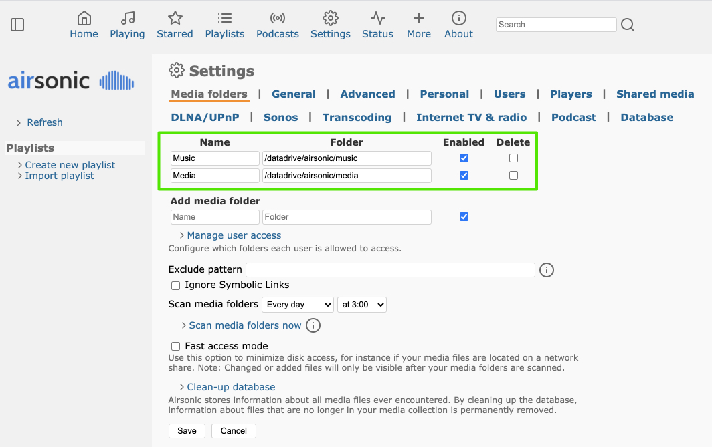
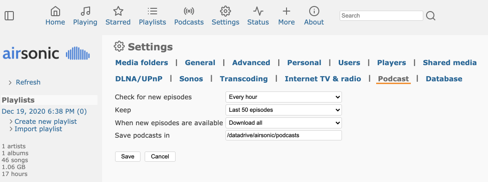
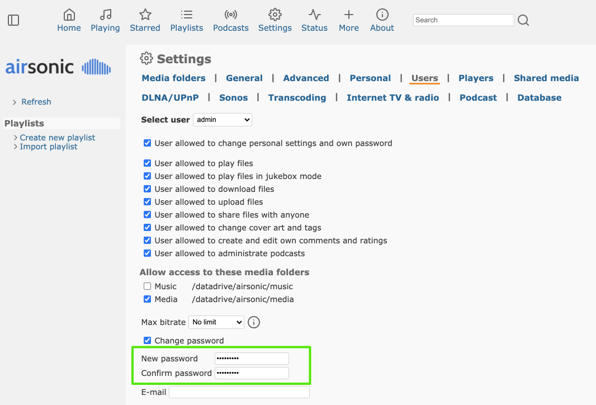
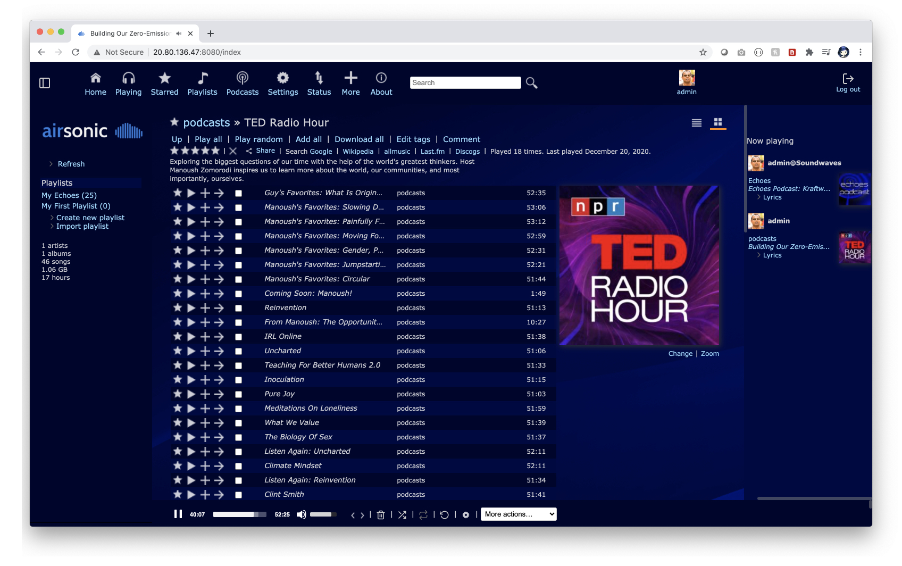
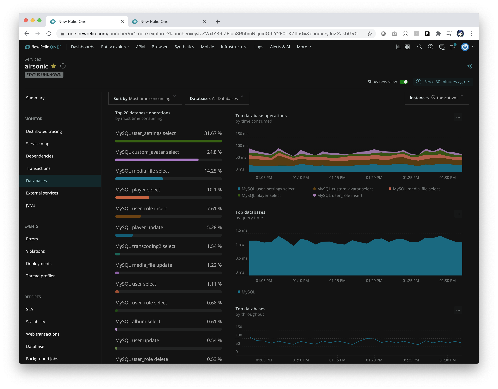
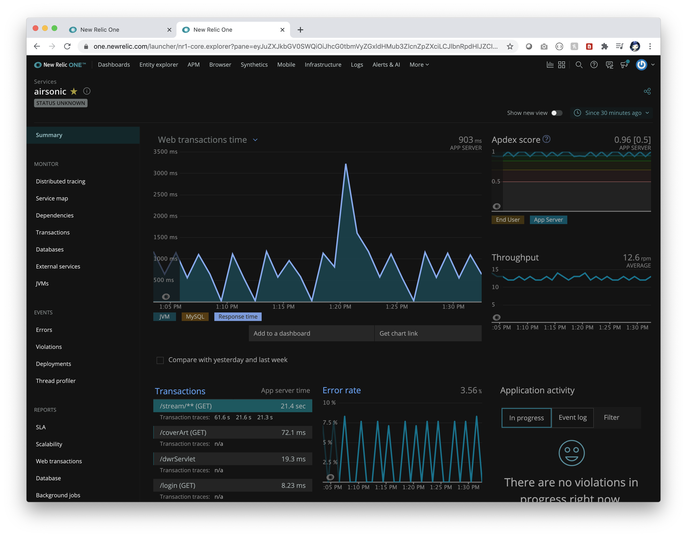

 
# Deploy Java app to Tomcat on Azure Linux Virtual Machines

Azure Linux Virtual Machines are versatile and 
accomodate any Java app types. This repo walks you through how to deploy
a real-world Java app to Tomcat on Azure Linux Virtual Machines.

## What will you experience
You will:
- Create a Linux virtual machine
- Install Apache Tomcat 9
- Deploy a real-world application to Tomcat 9 and install application dependencies
- Bind the application to Azure Database for MySQL
- Open the application
- Monitor application using Application Insights or APMs of your choice - New Relic, App Dynamics or Dynatrace.

## What you will need

In order to deploy a Java app to cloud, you need 
an Azure subscription. If you do not already have an Azure 
subscription, you can activate your 
[MSDN subscriber benefits](https://azure.microsoft.com/pricing/member-offers/msdn-benefits-details/) 
or sign up for a 
[free Azure account]((https://azure.microsoft.com/free/)).

In addition, you will need the following:

| [Azure CLI](https://docs.microsoft.com/cli/azure/install-azure-cli?view=azure-cli-latest) 
| [MySQL CLI](https://dev.mysql.com/downloads/shell/)
|

## Prepare dev machine

Create a bash script with environment variables by making a copy of the supplied template:
```bash
cp .scripts/setup-env-variables-azure-template.sh .scripts/setup-env-variables-azure.sh
```

Open `.scripts/setup-env-variables-azure.sh` and enter the following information:

```bash

# Supply Azure Subscription information
export SUBSCRIPTION=my-subscription-id # customize this

# Suppy Your Resource Group and Linux Virtual Machine info
export RESOURCE_GROUP=tomcat-iaas-12-2020 # customize this
export REGION=westus2 # customize this
export ADMIN_USERNAME=vm-admin-name # customize this

# Supply MySQL Database info
export MYSQL_SERVER_NAME=mysql-server-name # customize this
export MYSQL_SERVER_ADMIN_NAME=admin-name # customize this
export MYSQL_SERVER_ADMIN_PASSWORD=SuperS3cr3t # customize this

# Supply Password for airsonic app
export AIRSONIC_ADMIN_PASSWORD=SuperS3cr3t # customize this

```

Then, set the environment:
```bash
    source .scripts/setup-env-variables-azure.sh
```

Login to the Azure CLI and choose your active subscription. Be sure to choose the active subscription that is whitelisted for Azure Spring Cloud

```bash
    az login
    az account list -o table
    az account set --subscription ${SUBSCRIPTION}
```

## Create a Linux Virtual Machine with Java

Create a Linux Virtual Machine with Java using a quick start template. 
Accept all defaults in the template and modify the following parameters:
- Resource Group = `${RESOURCE_GROUP}`
- Admin Username = `${ADMIN_USERNAME}`
- Admin Key = `Your SSH Public Key`
- Public IP Sku =  `Standard`
 
<a href="https://portal.azure.com/#create/Microsoft.Template/uri/https%3A%2F%2Fraw.githubusercontent.com%2FAzure%2Fazure-quickstart-templates%2Fmaster%2F101-Linux-Java-ZuluOpenJDK%2Fazuredeploy.json" target="_blank">
    
</a>

Attach a 30 GB data disk to the virtual machine as described in [how to create and attach a
data disk](https://docs.microsoft.com/en-us/azure/virtual-machines/linux/attach-disk-portal). As described
in the document, open an SSH connection to the Linux Virtual Machine and mount the new disk.

# Install Apache Tomcat

[GET VM IP Address]

Open an SSH connection to the Linux Virtual Machine and install tomcat:

```bash
# Log into SSH session
ssh ${ADMIN_USERNAME}@${VM_IP_ADDRESS}

# Create a tomcat9 group
sudo groupadd tomcat9

# Create a new tomcat9 user
sudo useradd -s /bin/false -g tomcat9 -d /opt/tomcat9 tomcat9

# Download Apache Tomcat
cd /tmp
curl -O https://downloads.apache.org/tomcat/tomcat-9/v9.0.41/bin/apache-tomcat-9.0.41.tar.gz

# Install tomcat in /opt/tomcat9 directory
sudo mkdir /opt/tomcat9
sudo tar xzvf apache-tomcat-*tar.gz -C /opt/tomcat9 --strip-components=1

# Update permissions for tomcat9 directory
cd /opt/tomcat9
sudo chgrp -R tomcat9 /opt/tomcat9

# Give tomcat9 group read access
sudo chmod -R g+r conf
sudo chmod g+x conf

# Make the tomcat user the owner of the Web apps, work, temp, and logs directories:
sudo chown -R tomcat9 webapps/ work/ temp/ logs/

# ==== Create a systemd Service File
# find JAVA_HOME
sudo update-java-alternatives -l
# zulu-8-azure-amd64             1805006    /usr/lib/jvm/zulu-8-azure-amd64

# Open a file called tomcat9.service in the /etc/systemd/system
sudo nano /etc/systemd/system/tomcat9.service
```

Configure `tomcat9` as a service:

```text
# add the following to the /etc/systemd/system/tomcat9.service file

[Unit]
Description=Apache Tomcat Web Application Container
After=network.target

[Service]
Type=forking

Environment=JAVA_HOME=/usr/lib/jvm/zulu-8-azure-amd64
Environment=CATALINA_PID=/opt/tomcat9/temp/tomcat.pid
Environment=CATALINA_HOME=/opt/tomcat9
Environment=CATALINA_BASE=/opt/tomcat9
Environment='CATALINA_OPTS=-Xms8192M -Xmx8192M -server -XX:+UseParallelGC'
Environment='JAVA_OPTS=-Djava.awt.headless=true -Djava.security.egd=file:/dev/./urandom'

ExecStart=/opt/tomcat9/bin/startup.sh
ExecStop=/opt/tomcat9/bin/shutdown.sh

User=tomcat9
Group=tomcat9
UMask=0007
RestartSec=10
Restart=always

[Install]
WantedBy=multi-user.target
```

```bash
# reload the systemd daemon so that it knows about our service file
sudo systemctl daemon-reload
sudo systemctl start tomcat9
```

Customize Tomcat:
```bash
# Configure Tomcat 9
# Configure management user
sudo nano /opt/tomcat9/conf/tomcat-users.xml
```

Add a user with access to Tomcat Manager and Tools:

```xml
<tomcat-users>
    <role rolename="manager-gui"/>
    <role rolename="admin-gui"/>
    <role rolename="manager-script"/>
    <user username="manager" password="SuperS3cr3t" roles="manager-gui,admin-gui,manager-script"/>
</tomcat-users>
```

Continue to customize Tomcat:
```bash
# For the Manager app, type:
sudo nano /opt/tomcat9/webapps/manager/META-INF/context.xml

# For the Host Manager app, type:
sudo nano /opt/tomcat9/webapps/host-manager/META-INF/context.xml

# Inside, comment out the IP address restriction to allow connections from anywhere.
# Alternatively, if you would like to allow access only to connections 
# coming from your own IP address, you can add your public IP address to the list in
# context.xml files for Tomcat web apps
```
```xml
<Context antiResourceLocking="false" privileged="true" >
  <!--<Valve className="org.apache.catalina.valves.RemoteAddrValve"
         allow="127\.\d+\.\d+\.\d+|::1|0:0:0:0:0:0:0:1" />-->
</Context>
```
```bash
# Restart tomcat 9
sudo systemctl stop tomcat9
sudo systemctl start tomcat9

# Check the status of tomcat 9
sudo systemctl status tomcat9

# Enable the service file so that Tomcat automatically starts at boot:
sudo systemctl enable tomcat9
```

From your dev machine, open up ports to access Tomcat
```bash
# Open up ports from your dev machine
az vm open-port --port 8080 --resource-group ${RESOURCE_GROUP} --name ${VM_NAME} --priority 1100
```

# Install airsonic application

Reopen an SSH connection into the Linux Virtual Machine:

```bash
# Log into SSH session
ssh ${ADMIN_USERNAME}@${VM_IP_ADDRESS}

cd /tmp

# Download airsonic WAR package
wget https://github.com/airsonic/airsonic/releases/download/v10.6.2/airsonic.war

# Download and import Andrew DeMaria public key:
gpg --keyserver keyserver.ubuntu.com --recv 0A3F5E91F8364EDF

# Download the signed checksums file and verify the previously download .war package:

wget https://github.com/airsonic/airsonic/releases/download/v10.6.2/artifacts-checksums.sha.asc
gpg --verify artifacts-checksums.sha.asc
sha256sum -c artifacts-checksums.sha.asc

# Create the airsonic directory and assign ownership to the 
# Tomcat system user (if running Tomcat as a service):

sudo mkdir /datadrive/airsonic/
sudo chown -R tomcat9:tomcat9 /datadrive/airsonic/

# Stop Tomcat 9
sudo systemctl stop tomcat9

# Move airsonic into Tomcat 9
# Move the downloaded WAR file in the $TOMCAT_HOME/webapps 
# folder and assign ownership to the Tomcat system user:
sudo mv airsonic.war /opt/tomcat9/webapps/airsonic.war
sudo chown tomcat9:tomcat9 /opt/tomcat9/webapps/airsonic.war

# add Read Write paths to Tomcat
sudo nano /etc/systemd/system/tomcat9.service
```

Add `Read` and `Write` paths, and airsonic home directory to 
Tomcat systemd service definition by adding `ReadWritePaths=/datadrive/airsonic/`
to systemd service definition and adding `-Dairsonic.home=/datadrive/airsonic` 
to `JAVA_OPTS` environment variable:
```text
[Unit]
Description=Apache Tomcat Web Application Container
After=network.target

[Service]
Type=forking

Environment=JAVA_HOME=/usr/lib/jvm/zulu-8-azure-amd64
Environment=CATALINA_PID=/opt/tomcat9/temp/tomcat.pid
Environment=CATALINA_HOME=/opt/tomcat9
Environment=CATALINA_BASE=/opt/tomcat9
Environment='CATALINA_OPTS=-Xms512M -Xmx1024M -server -XX:+UseParallelGC'
Environment='JAVA_OPTS=-Djava.awt.headless=true -Djava.security.egd=file:/dev/./urandom -Dairsonic.home=/datadrive/airsonic'

ExecStart=/opt/tomcat9/bin/startup.sh
ExecStop=/opt/tomcat9/bin/shutdown.sh

User=tomcat9
Group=tomcat9
UMask=0007
RestartSec=10
Restart=always

ReadWritePaths=/datadrive/airsonic/

[Install]
WantedBy=multi-user.target
```

Modify the Tomcat `server.xml`:

```bash
# Edit server.xml
sudo nano /opt/tomcat9/conf/server.xml
```

You will need to add the following right above the `</Host>` tag in `server.xml`:
```xml
        <Context path="" docBase="airsonic" debug="0" reloadable="true">
                <WatchedResource>WEB-INF/web.xml</WatchedResource>
        </Context>
        <Context path="ROOT" docBase="ROOT"> <!-- Default set of monitored resources -->
                <WatchedResource>WEB-INF/web.xml</WatchedResource>
        </Context>
```

```bash
# Reload the systemd configuration:
sudo systemctl daemon-reload

# Install ffmpeg package:
# Reference https://airsonic.github.io/docs/transcode/#on-ubuntu--1604
sudo snap install ffmpeg

# Create a transcode directory within your AIRSONIC_HOME directory:

sudo mkdir /datadrive/airsonic/transcode

# Within the transcode directory symlink to ffmpeg and verify correct permissions:

cd /datadrive/airsonic/transcode/
sudo ln -s /usr/bin/ffmpeg
sudo chown -h tomcat9:tomcat9 ffmpeg
ls -alh

# create music, media, podcasts and playlists folders
cd /datadrive/airsonic/
sudo mkdir music
sudo mkdir media
sudo mkdir podcasts
sudo mkdir playlists

sudo chown -R tomcat9 transcode/ music/ media/ podcasts/ playlists/
sudo chmod 777 /datadrive/airsonic/music

# =============================
```

## Create a MySQL database

From your dev machine, create a MySQL database:

```bash
# Create mysql server
az mysql server create --resource-group ${RESOURCE_GROUP} \
 --name ${MYSQL_SERVER_NAME}  --location ${REGION} \
 --admin-user ${MYSQL_SERVER_ADMIN_NAME} \
 --admin-password ${MYSQL_SERVER_ADMIN_PASSWORD} \
 --sku-name GP_Gen5_2 \
 --ssl-enforcement Disabled \
 --version 5.7

# Allow access from Azure resources
az mysql server firewall-rule create --name allAzureIPs \
 --server ${MYSQL_SERVER_NAME} \
 --resource-group ${RESOURCE_GROUP} \
 --start-ip-address 0.0.0.0 --end-ip-address 0.0.0.0

# Allow access from your dev machine for testing
az mysql server firewall-rule create --name devMachine \
 --server ${MYSQL_SERVER_NAME} \
 --resource-group ${RESOURCE_GROUP} \
 --start-ip-address <ip-address-of-your-dev-machine> \
 --end-ip-address <ip-address-of-your-dev-machine>

# Increase connection timeout
az mysql server configuration set --name wait_timeout \
 --resource-group ${RESOURCE_GROUP} \
 --server ${MYSQL_SERVER_NAME} --value 2147483

# Connect to MySQL Server
mysql -u ${MYSQL_SERVER_ADMIN_LOGIN_NAME} \
 -h ${MYSQL_SERVER_FULL_NAME} -P 3306 -p

Enter password:
Welcome to the MySQL monitor.  Commands end with ; or \g.
Your MySQL connection id is 64379
Server version: 5.6.39.0 MySQL Community Server (GPL)

Copyright (c) 2000, 2018, Oracle and/or its affiliates. All rights reserved.

Oracle is a registered trademark of Oracle Corporation and/or its
affiliates. Other names may be trademarks of their respective
owners.

Type 'help;' or '\h' for help. Type '\c' to clear the current input statement.

mysql> CREATE DATABASE airsonic;
Query OK, 1 row affected (0.10 sec)

mysql> CREATE USER 'root' IDENTIFIED BY 'airsonic';
Query OK, 0 rows affected (0.11 sec)

mysql> GRANT ALL PRIVILEGES ON airsonic.* TO 'root';
Query OK, 0 rows affected (1.29 sec)

mysql> CALL mysql.az_load_timezone();
Query OK, 3179 rows affected, 1 warning (6.34 sec)

mysql> SELECT name FROM mysql.time_zone_name;
...

mysql> quit
Bye

# Configure time zone
az mysql server configuration set --name time_zone \
 --resource-group ${RESOURCE_GROUP} \
 --server ${MYSQL_SERVER_NAME} --value "US/Pacific"
```

## Bind airsonic application to MySQL database

Reopen an SSH connection to the Linux virtual machine:

```bash
# Log into SSH session
ssh ${ADMIN_USERNAME}@${VM_IP_ADDRESS}

# In the airsonic.properties file, 
# you will need to add the following settings:

sudo nano /datadrive/airsonic/airsonic.properties

# add the following to the bottom of airsonic.properties
DatabaseConfigType=jndi
DatabaseConfigJNDIName=jdbc/airsonicDB

# Then in the opt/tomcat9/conf/context.xml in the tomcat directory, 
# add the jndi config:

sudo nano /opt/tomcat9/conf/context.xml

```
```xml
<Resource name="jdbc/airsonicDB" auth="Container"
    type="javax.sql.DataSource"
    maxActive="20"
    maxIdle="30"
    maxWait="10000"
    username="${MYSQL_SERVER_ADMIN_LOGIN_NAME}"
    password="${MYSQL_SERVER_ADMIN_PASSWORD}"
    driverClassName="com.mysql.jdbc.Driver"
    url="jdbc:mysql://${MYSQL_SERVER_FULL_NAME}:3306/${MYSQL_DATABASE_NAME}?useSSL=false&amp;sessionVariables=sql_mode=ANSI_QUOTES"/>
```
```bash
# Open the file called tomcat.service in the /etc/systemd/system

sudo nano /etc/systemd/system/tomcat9.service

# add few more environment properties and adjust JAVA_OPTS

Environment=MYSQL_SERVER_NAME=<your-mysql-server-name>
Environment=MYSQL_SERVER_FULL_NAME=<your-mysql-server-name>.mysql.database.azure.com
Environment=MYSQL_SERVER_ADMIN_LOGIN_NAME=<your-admin-name>@<your-mysql-server-name>
Environment=MYSQL_SERVER_ADMIN_PASSWORD=<your-admin-password>
Environment=MYSQL_DATABASE_NAME=airsonic
Environment='CATALINA_OPTS=-Xms8192M -Xmx8192M -server -XX:+UseParallelGC'
Environment='JAVA_OPTS=-Djava.awt.headless=true -Djava.security.egd=file:/dev/./urandom -Dairsonic.home=/datadrive/airsonic -DMYSQL_SERVER_FULL_NAME=${MYSQL_SERVER_FULL_NAME} -DMYSQL_DATABASE_NAME=${MYSQL_DATABASE_NAME} -DMYSQL_SERVER_ADMIN_LOGIN_NAME=${MYSQL_SERVER_ADMIN_LOGIN_NAME} -DMYSQL_SERVER_ADMIN_PASSWORD=${MYSQL_SERVER_ADMIN_PASSWORD}'

# Reload the systemd configuration:
sudo systemctl daemon-reload

# Download MySQL Driver
# https://dev.mysql.com/downloads/connector/j/

cd /tmp
wget https://downloads.mysql.com/archives/get/p/3/file/mysql-connector-java-5.1.48.tar.gz

# extract
tar xvzf mysql-connector-java-5.1.48.tar.gz

# copy to Tomcat9/lib folder
sudo cp mysql-connector-java-5.1.48/mysql-connector-java-5.1.48.jar /opt/tomcat9/lib
```

## Install New Relic application performance monitoring agent

Continue to use the SSH connection to Linux virtual machine and install the New
Relic application performance monitoring agent:
```bash
# Install New Relic agent
# // Get New Relic JAR
curl -O https://download.newrelic.com/newrelic/java-agent/newrelic-agent/current/newrelic-java.zip
sudo apt install unzip
unzip newrelic-java.zip

# Edit the New Relic configuration file
sudo nano newrelic/newrelic.yml

# Set New Relic license key and airsonic application name
  ...
  license_key: <insert-your-New-Relic-license-key>
  ...
  app_name: airsonic

# Copy New Relic JAR and configuration file to /opt/newrelic
sudo mkdir /opt/newrelic
sudo cp newrelic/newrelic.jar /opt/newrelic
sudo cp newrelic/newrelic.yml /opt/newrelic
sudo chgrp -R tomcat9 /opt/newrelic

# Open the file called tomcat.service in the /etc/systemd/system
sudo nano /etc/systemd/system/tomcat9.service

# Add adjust Environment Variables and JAVA_OPTS
Environment='JAVA_OPTS=-Djava.awt.headless=true -Djava.security.egd=file:/dev/./urandom -Dairsonic.home=/datadrive/airsonic -DMYSQL_SERVER_FULL_NAME=${MYSQL_SERVER_FULL_NAME} -DMYSQL_DATABASE_NAME=${MYSQL_DATABASE_NAME} -DMYSQL_SERVER_ADMIN_LOGIN_NAME=${MYSQL_SERVER_ADMIN_LOGIN_NAME} -DMYSQL_SERVER_ADMIN_PASSWORD=${MYSQL_SERVER_ADMIN_PASSWORD} -javaagent:/opt/newrelic/newrelic.jar'

# Reload the systemd configuration:
sudo systemctl daemon-reload

# restart Tomcat 9 with airsonic running with MySQL
sudo systemctl stop tomcat9
sudo systemctl start tomcat9
sudo systemctl status tomcat9

# Tail logs
sudo tail -f /opt/tomcat9/logs/catalina.out
```

You will see the following logs to confirm airsonic application startup:

```text
           _                       _          
     /\   (_)                     (_)         
    /  \   _ _ __  ___  ___  _ __  _  ___     
   / /\ \ | | '__|/ __|/ _ \| '_ \| |/ __|    
  / ____ \| | |   \__ \ (_) | | | | | (__     
 /_/    \_\_|_|   |___/\___/|_| |_|_|\___|    
                                               
                        10.6.2-RELEASE

2020-12-20 20:32:14.506  INFO --- org.airsonic.player.Application          : Starting Application v10.6.2-RELEASE on tomcat-vm with PID 64604 (/opt/tomcat9/webapps/airsonic/WEB-INF/classes started by tomcat9 in /)
2020-12-20 20:32:14.510  INFO --- org.airsonic.player.Application          : The following profiles are active: jndi
Loading class `com.mysql.jdbc.Driver'. This is deprecated. The new driver class is `com.mysql.cj.jdbc.Driver'. The driver is automatically registered via the SPI and manual loading of the driver class is generally unnecessary.
2020-12-20 20:32:22.342  INFO --- l.executor.jvm.JdbcExecutor              : SELECT COUNT(*) FROM airsonic.DATABASECHANGELOGLOCK
2020-12-20 20:32:22.346  INFO --- l.executor.jvm.JdbcExecutor              : SELECT COUNT(*) FROM airsonic.DATABASECHANGELOGLOCK
2020-12-20 20:32:22.374  INFO --- l.l.StandardLockService                  : Successfully acquired change log lock
2020-12-20 20:32:25.691  INFO --- l.executor.jvm.JdbcExecutor              : SELECT MD5SUM FROM airsonic.DATABASECHANGELOG WHERE MD5SUM IS NOT NULL LIMIT 1
2020-12-20 20:32:25.696  INFO --- l.executor.jvm.JdbcExecutor              : SELECT COUNT(*) FROM airsonic.DATABASECHANGELOG
2020-12-20 20:32:25.697  INFO --- l.c.StandardChangeLogHistoryService      : Reading from airsonic.DATABASECHANGELOG
2020-12-20 20:32:25.698  INFO --- l.executor.jvm.JdbcExecutor              : SELECT * FROM airsonic.DATABASECHANGELOG ORDER BY DATEEXECUTED ASC, ORDEREXECUTED ASC
2020-12-20 20:32:25.917  INFO --- l.l.StandardLockService                  : Successfully released change log lock
2020-12-20 20:32:25.921  INFO --- l.executor.jvm.JdbcExecutor              : SELECT COUNT(*) FROM airsonic.DATABASECHANGELOGLOCK
2020-12-20 20:32:25.923  INFO --- l.executor.jvm.JdbcExecutor              : SELECT COUNT(*) FROM airsonic.DATABASECHANGELOGLOCK
2020-12-20 20:32:25.925  INFO --- l.executor.jvm.JdbcExecutor              : SELECT `LOCKED` FROM airsonic.DATABASECHANGELOGLOCK WHERE ID=1
2020-12-20 20:32:25.939  INFO --- l.l.StandardLockService                  : Successfully acquired change log lock
2020-12-20 20:32:26.003  INFO --- l.executor.jvm.JdbcExecutor              : SELECT MD5SUM FROM airsonic.DATABASECHANGELOG WHERE MD5SUM IS NOT NULL LIMIT 1
2020-12-20 20:32:26.004  INFO --- l.executor.jvm.JdbcExecutor              : SELECT COUNT(*) FROM airsonic.DATABASECHANGELOG
2020-12-20 20:32:26.007  INFO --- l.c.StandardChangeLogHistoryService      : Reading from airsonic.DATABASECHANGELOG
2020-12-20 20:32:26.008  INFO --- l.executor.jvm.JdbcExecutor              : SELECT * FROM airsonic.DATABASECHANGELOG ORDER BY DATEEXECUTED ASC, ORDEREXECUTED ASC
2020-12-20 20:32:26.054  INFO --- l.l.StandardLockService                  : Successfully released change log lock
2020-12-20 20:32:26.243  INFO --- o.a.p.service.SettingsService            : Java: 1.8.0_275, OS: Linux
2020-12-20 20:32:32.014  INFO --- o.a.p.s.search.IndexManager              : Index was found (index version 18). 
2020-12-20 20:32:32.019  INFO --- o.a.p.s.MediaScannerService              : Automatic media library scanning scheduled to run every 1 day(s), starting at 2020-12-21T03:00:00.017
2020-12-20 20:32:34.368  INFO --- o.a.p.service.PodcastService             : Automatic Podcast update scheduled to run every 1 hour(s), starting at Sun Dec 20 20:37:34 UTC 2020
2020-12-20 20:32:37.850  INFO --- org.airsonic.player.Application          : Detected Tomcat web server
2020-12-20 20:32:40.439  INFO --- org.airsonic.player.Application          : Started Application in 27.989 seconds (JVM running for 101.178)
20-Dec-2020 20:32:41.241 INFO [main] org.apache.catalina.startup.HostConfig.deployWAR Deployment of web application archive [/opt/tomcat9/webapps/airsonic.war] has finished in [37,219] ms
20-Dec-2020 20:32:41.242 INFO [main] org.apache.catalina.startup.HostConfig.deployDirectory Deploying web application directory [/opt/tomcat9/webapps/manager]
20-Dec-2020 20:32:42.472 INFO [main] org.apache.jasper.servlet.TldScanner.scanJars At least one JAR was scanned for TLDs yet contained no TLDs. Enable debug logging for this logger for a complete list of JARs that were scanned but no TLDs were found in them. Skipping unneeded JARs during scanning can improve startup time and JSP compilation time.
20-Dec-2020 20:32:42.494 INFO [main] org.apache.catalina.startup.HostConfig.deployDirectory Deployment of web application directory [/opt/tomcat9/webapps/manager] has finished in [1,252] ms
20-Dec-2020 20:32:42.495 INFO [main] org.apache.catalina.startup.HostConfig.deployDirectory Deploying web application directory [/opt/tomcat9/webapps/examples]
20-Dec-2020 20:32:44.022 INFO [main] org.apache.jasper.servlet.TldScanner.scanJars At least one JAR was scanned for TLDs yet contained no TLDs. Enable debug logging for this logger for a complete list of JARs that were scanned but no TLDs were found in them. Skipping unneeded JARs during scanning can improve startup time and JSP compilation time.
20-Dec-2020 20:32:44.106 INFO [main] org.apache.catalina.startup.HostConfig.deployDirectory Deployment of web application directory [/opt/tomcat9/webapps/examples] has finished in [1,611] ms
20-Dec-2020 20:32:44.106 INFO [main] org.apache.catalina.startup.HostConfig.deployDirectory Deploying web application directory [/opt/tomcat9/webapps/host-manager]
20-Dec-2020 20:32:45.423 INFO [main] org.apache.jasper.servlet.TldScanner.scanJars At least one JAR was scanned for TLDs yet contained no TLDs. Enable debug logging for this logger for a complete list of JARs that were scanned but no TLDs were found in them. Skipping unneeded JARs during scanning can improve startup time and JSP compilation time.
20-Dec-2020 20:32:45.426 INFO [main] org.apache.catalina.startup.HostConfig.deployDirectory Deployment of web application directory [/opt/tomcat9/webapps/host-manager] has finished in [1,320] ms
20-Dec-2020 20:32:45.427 INFO [main] org.apache.catalina.startup.HostConfig.deployDirectory Deploying web application directory [/opt/tomcat9/webapps/docs]
20-Dec-2020 20:32:46.444 INFO [main] org.apache.jasper.servlet.TldScanner.scanJars At least one JAR was scanned for TLDs yet contained no TLDs. Enable debug logging for this logger for a complete list of JARs that were scanned but no TLDs were found in them. Skipping unneeded JARs during scanning can improve startup time and JSP compilation time.
20-Dec-2020 20:32:46.447 INFO [main] org.apache.catalina.startup.HostConfig.deployDirectory Deployment of web application directory [/opt/tomcat9/webapps/docs] has finished in [1,020] ms
20-Dec-2020 20:32:46.457 INFO [main] org.apache.coyote.AbstractProtocol.start Starting ProtocolHandler ["http-nio-8080"]
20-Dec-2020 20:32:46.469 INFO [main] org.apache.catalina.startup.Catalina.start Server startup in [91313] milliseconds
2020-12-20 20:32:47.435  INFO --- o.a.p.f.BootstrapVerificationFilter      : Servlet container: Apache Tomcat/9.0.41

```

There is an open issue with the airsonic application's MySQL database schema.
Fix the schema to address the open issue. Log into the MySQL server from your 
dev machine:

```bash
# Fix the table issue https://ask.csdn.net/questions/1926148
# from the dev machine ...

mysql -u ${MYSQL_SERVER_ADMIN_LOGIN_NAME} \
 -h ${MYSQL_SERVER_FULL_NAME} -P 3306 -p

Enter password:
Welcome to the MySQL monitor.  Commands end with ; or \g.
Your MySQL connection id is 64379
Server version: 5.6.39.0 MySQL Community Server (GPL)

Copyright (c) 2000, 2018, Oracle and/or its affiliates. All rights reserved.

Oracle is a registered trademark of Oracle Corporation and/or its
affiliates. Other names may be trademarks of their respective
owners.

Type 'help;' or '\h' for help. Type '\c' to clear the current input statement.

mysql> use airsonic;
Reading table information for completion of table and column names
You can turn off this feature to get a quicker startup with -A

Database changed

mysql> ALTER TABLE podcast_episode MODIFY COLUMN description VARCHAR(4096);

mysql> ALTER TABLE podcast_channel MODIFY COLUMN description VARCHAR(4096);
```

## Open and configure airsonic application

Open the airsonic application from your dev machine:

```bash
# Open airsonic Web app from your dev machine
open http://${VM_IP_ADDRESS}:8080
```

Login with airsonic application's default `admin` username and `admin` password. 
Change the admin password and configure the following:

 





Open the `Podcasts` menu and subscribe to a few podcast feeds:

```text
# +--------------------------------------------------------------------------------------+
# | url                                                                                  |
# +--------------------------------------------------------------------------------------+
# | https://feeds.npr.org/510298/podcast.xml                                             |
# | http://feeds.feedburner.com/pri/world-words                                          |
# | http://www.cbc.ca/podcasting/includes/asithappens.xml                                |
# | http://feeds.feedburner.com/WQXRsTheWashingtonReport                                 |
# | http://echoes.org/podcasts/feed                                                      |
# | https://feeds.npr.org/344098539/podcast.xml                                          |
# | https://www.marketplace.org/feed/podcast/marketplace                                 |
# | https://feeds.publicradio.org/public_feeds/composers-datebook/rss/rss                |
# | https://www.marketplace.org/feed/podcast/codebreaker-by-marketplace-and-tech-insider |
# | https://video-api.wsj.com/podcast/rss/wsj/your-money-matters                         |
# | https://video-api.wsj.com/podcast/rss/wsj/secrets-of-wealthy-women                   |
# | https://video-api.wsj.com/podcast/rss/wsj/tech-news-briefing                         |
# +--------------------------------------------------------------------------------------+
```

airsonic application will start downloading podcasts and may look like:


Go to your New Relic dashboard and observe airsonic application performance:



## Contributing

This project welcomes contributions and suggestions.  Most contributions require you to agree to a
Contributor License Agreement (CLA) declaring that you have the right to, and actually do, grant us
the rights to use your contribution. For details, visit https://cla.opensource.microsoft.com.

When you submit a pull request, a CLA bot will automatically determine whether you need to provide
a CLA and decorate the PR appropriately (e.g., status check, comment). Simply follow the instructions
provided by the bot. You will only need to do this once across all repos using our CLA.

This project has adopted the [Microsoft Open Source Code of Conduct](https://opensource.microsoft.com/codeofconduct/).
For more information see the [Code of Conduct FAQ](https://opensource.microsoft.com/codeofconduct/faq/) or
contact [opencode@microsoft.com](mailto:opencode@microsoft.com) with any additional questions or comments.

