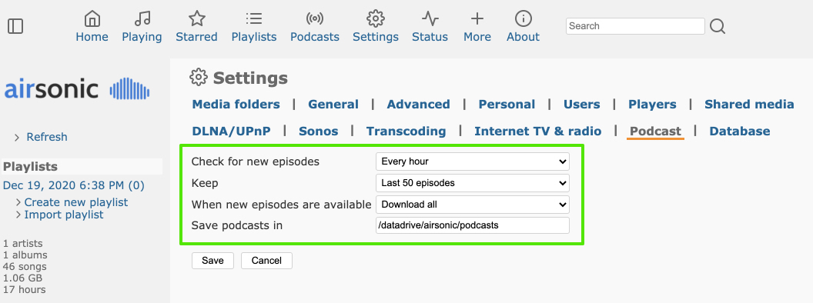
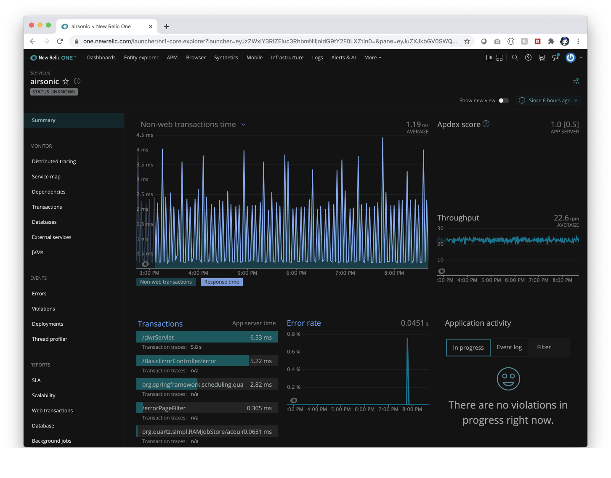

# Migration of Java Tomcat Application to AWS EKS using Terraform

This guide covers the steps necessary to migrate a Java Tomcat application running in a virtual machine to AWS Elastic Container Service for Kubernetes (EKS) using Terraform. This guide assumes that you have a basic understanding of AWS, Kubernetes, and Terraform.

## Prerequisites

- A Java Tomcat application running in a virtual machine with access to the application code and required dependencies.
- An AWS account with the necessary permissions to create EKS clusters, EC2 instances, and other AWS resources.
- Terraform installed and configured on the virtual machine.
- AWS CLI installed and configured on the virtual machine.
- kubectl installed and configured on the virtual machine.
- Docker installed and configured on the virtual machine.

## Steps

1. Clone the Terraform Infrastructure Repository
2. Dockerize the Java Tomcat Application
3. Initialize and Apply the Terraform Code
4. Connect to the EKS Cluster
5. Deploy the Docker Image to the EKS Cluster
6. Expose the Deployment as a Service
7. Test the Application

## Step 1: Clone the Terraform Infrastructure Repository

Connect to the virtual machine where the Java Tomcat application is running. 
Clone the Terraform infrastructure repository using the following command:

```bash
git clone [REPO_URL]
```
Replace [REPO_URL] with the URL of the Terraform infrastructure repository


## Step 2: Dockerize the Java Tomcat Application
The first step in migrating the application is to containerize it using Docker. This will make it easier to deploy and manage in AWS EKS.

Navigate to the directory where the application code is located.
Create a Dockerfile with the following contents:

```Dockerfile
FROM tomcat:8-jre8
COPY [YOUR_APPLICATION_WAR_FILE] /usr/local/tomcat/webapps/
EXPOSE 8080
CMD ["catalina.sh", "run"]
```

Replace [YOUR_APPLICATION_WAR_FILE] with the name of the WAR file for your Java Tomcat application.
Build the Docker image using the following command:
```
docker build -t [IMAGE_NAME] .
```
Replace [IMAGE_NAME] with a name for the Docker image.
Push the Docker image to a Docker registry, such as Docker Hub or Amazon Elastic Container Registry (ECR).

## Step 3: Initialize and Apply the Terraform Code
In this step, you will use Terraform to create the EKS cluster in AWS.

Navigate to the infra-eks/dev directory within the cloned Terraform infrastructure repository.
Initialize Terraform using the following command:
```
terraform init
```
Apply the Terraform code using the following command:
```
terraform apply
```
Answer the prompts to confirm the creation of the resources.
Wait for Terraform to complete the creation of the resources. This can take several minutes.

## Step 4: Connect to the EKS Cluster
In this step, you will connect to the EKS cluster created in step 3.

Run the following command to update the kubectl configuration:
```
aws eks update-kubeconfig --name [CLUSTER_NAME]
```
Replace [CLUSTER_NAME] with the name of the EKS cluster
Step 5: Deploy the Docker Image to the EKS Cluster
In this step, you will deploy the Docker image to the EKS cluster.

Create a Kubernetes deployment using the following command:
```
kubectl create deployment [DEPLOYMENT_NAME] --image=[IMAGE_NAME]
```
Replace [DEPLOYMENT_NAME] with a name for the Kubernetes deployment.
Replace [IMAGE_NAME] with the name of the Docker image.

## Step 6: Expose the Deployment as a Service
In this step, you will expose the deployment as a service, making it accessible from the internet.

Create a Kubernetes service using the following command:
```
kubectl expose deployment [DEPLOYMENT_NAME] --type=LoadBalancer --port=8080 --target-port=8080
```
Replace [DEPLOYMENT_NAME] with the name of the deployment created in step 5.

## Step 7: Test the Application
In this step, you will test the application to ensure it is working as expected.

Run the following command to get the public endpoint for the service:
```
kubectl get services
```
Access the application using a web browser using the public endpoint.
Verify that the application is working as expected.


# Working in progress changing to AWS VM

---
page_type: sample
languages:
- java
products:
- azure
- azure-virtual-machines
- MySQL
extensions:
- services: MySQL
- platforms: java
description: "Deploy Java app to Tomcat in Azure Linux Virtual Machine"
urlFragment: "tomcat-on-virtual-machine"
---
 
# Deploy Java app to Tomcat on Azure Linux Virtual Machines

Azure Linux Virtual Machines are versatile and 
accomodate any Java app types. This repo walks you through how to deploy
a real-world Java app to Tomcat on Azure Linux Virtual Machines.

## What will you experience
You will:
- Create a Linux virtual machine
- Install Apache Tomcat 9
- Deploy a real-world application to Tomcat 9 and install application dependencies
- Bind the application to Azure Database for MySQL
- Open the application
- Monitor application using Application Insights or APMs of your choice - New Relic, App Dynamics or Dynatrace.

## What you will need

- AWS Account and EC2 VM already setup


# Install Apache Tomcat

[GET VM IP Address]

Open an SSH connection to the Linux Virtual Machine and install tomcat:

```bash
# Log into SSH session
ssh ${ADMIN_USERNAME}@${VM_IP_ADDRESS}

# Create a tomcat9 group
sudo groupadd tomcat9

# Create a new tomcat9 user
sudo useradd -s /bin/false -g tomcat9 -d /opt/tomcat9 tomcat9

# Download Apache Tomcat
cd /tmp
curl -O https://downloads.apache.org/tomcat/tomcat-9/v9.0.41/bin/apache-tomcat-9.0.41.tar.gz

# Install tomcat in /opt/tomcat9 directory
sudo mkdir /opt/tomcat9
sudo tar xzvf apache-tomcat-*tar.gz -C /opt/tomcat9 --strip-components=1

# Update permissions for tomcat9 directory
cd /opt/tomcat9
sudo chgrp -R tomcat9 /opt/tomcat9

# Give tomcat9 group read access
sudo chmod -R g+r conf
sudo chmod g+x conf

# Make the tomcat user the owner of the Web apps, work, temp, and logs directories:
sudo chown -R tomcat9 webapps/ work/ temp/ logs/

# ==== Create a systemd Service File
# find JAVA_HOME
sudo update-java-alternatives -l
# zulu-8-azure-amd64             1805006    /usr/lib/jvm/zulu-8-azure-amd64

# Open a file called tomcat9.service in the /etc/systemd/system
sudo nano /etc/systemd/system/tomcat9.service
```

Configure `tomcat9` as a service:

```text
# add the following to the /etc/systemd/system/tomcat9.service file

[Unit]
Description=Apache Tomcat Web Application Container
After=network.target

[Service]
Type=forking

Environment=JAVA_HOME=/usr/lib/jvm/zulu-8-azure-amd64
Environment=CATALINA_PID=/opt/tomcat9/temp/tomcat.pid
Environment=CATALINA_HOME=/opt/tomcat9
Environment=CATALINA_BASE=/opt/tomcat9
Environment='CATALINA_OPTS=-Xms8192M -Xmx8192M -server -XX:+UseParallelGC'
Environment='JAVA_OPTS=-Djava.awt.headless=true -Djava.security.egd=file:/dev/./urandom'

ExecStart=/opt/tomcat9/bin/startup.sh
ExecStop=/opt/tomcat9/bin/shutdown.sh

User=tomcat9
Group=tomcat9
UMask=0007
RestartSec=10
Restart=always

[Install]
WantedBy=multi-user.target
```

```bash
# reload the systemd daemon so that it knows about our service file
sudo systemctl daemon-reload
sudo systemctl start tomcat9
```

Customize Tomcat:
```bash
# Configure Tomcat 9
# Configure management user
sudo nano /opt/tomcat9/conf/tomcat-users.xml
```

Add a user with access to Tomcat Manager and Tools:

```xml
<tomcat-users>
    <role rolename="manager-gui"/>
    <role rolename="admin-gui"/>
    <role rolename="manager-script"/>
    <user username="manager" password="SuperS3cr3t" roles="manager-gui,admin-gui,manager-script"/>
</tomcat-users>
```

Continue to customize Tomcat:
```bash
# For the Manager app, type:
sudo nano /opt/tomcat9/webapps/manager/META-INF/context.xml

# For the Host Manager app, type:
sudo nano /opt/tomcat9/webapps/host-manager/META-INF/context.xml

# Inside, comment out the IP address restriction to allow connections from anywhere.
# Alternatively, if you would like to allow access only to connections 
# coming from your own IP address, you can add your public IP address to the list in
# context.xml files for Tomcat web apps
```
```xml
<Context antiResourceLocking="false" privileged="true" >
  <!--<Valve className="org.apache.catalina.valves.RemoteAddrValve"
         allow="127\.\d+\.\d+\.\d+|::1|0:0:0:0:0:0:0:1" />-->
</Context>
```
```bash
# Restart tomcat 9
sudo systemctl stop tomcat9
sudo systemctl start tomcat9

# Check the status of tomcat 9
sudo systemctl status tomcat9

# Enable the service file so that Tomcat automatically starts at boot:
sudo systemctl enable tomcat9
```

From your dev machine, open up ports to access Tomcat
```bash
# Open up ports from your dev machine
az vm open-port --port 8080 --resource-group ${RESOURCE_GROUP} --name ${VM_NAME} --priority 1100
```

# Install airsonic application

Reopen an SSH connection into the Linux Virtual Machine:

```bash
# Log into SSH session
ssh ${ADMIN_USERNAME}@${VM_IP_ADDRESS}

cd /tmp

# Download airsonic WAR package
wget https://github.com/airsonic/airsonic/releases/download/v10.6.2/airsonic.war

# Download and import Andrew DeMaria public key:
gpg --keyserver keyserver.ubuntu.com --recv 0A3F5E91F8364EDF

# Download the signed checksums file and verify the previously download .war package:

wget https://github.com/airsonic/airsonic/releases/download/v10.6.2/artifacts-checksums.sha.asc
gpg --verify artifacts-checksums.sha.asc
sha256sum -c artifacts-checksums.sha.asc

# Create the airsonic directory and assign ownership to the 
# Tomcat system user (if running Tomcat as a service):

sudo mkdir /datadrive/airsonic/
sudo chown -R tomcat9:tomcat9 /datadrive/airsonic/

# Stop Tomcat 9
sudo systemctl stop tomcat9

# Move airsonic into Tomcat 9
# Move the downloaded WAR file in the $TOMCAT_HOME/webapps 
# folder and assign ownership to the Tomcat system user:
sudo mv airsonic.war /opt/tomcat9/webapps/airsonic.war
sudo chown tomcat9:tomcat9 /opt/tomcat9/webapps/airsonic.war

# add Read Write paths to Tomcat
sudo nano /etc/systemd/system/tomcat9.service
```

Add `Read` and `Write` paths, and airsonic home directory to 
Tomcat systemd service definition by adding `ReadWritePaths=/datadrive/airsonic/`
to systemd service definition and adding `-Dairsonic.home=/datadrive/airsonic` 
to `JAVA_OPTS` environment variable:
```text
[Unit]
Description=Apache Tomcat Web Application Container
After=network.target

[Service]
Type=forking

Environment=JAVA_HOME=/usr/lib/jvm/zulu-8-azure-amd64
Environment=CATALINA_PID=/opt/tomcat9/temp/tomcat.pid
Environment=CATALINA_HOME=/opt/tomcat9
Environment=CATALINA_BASE=/opt/tomcat9
Environment='CATALINA_OPTS=-Xms512M -Xmx1024M -server -XX:+UseParallelGC'
Environment='JAVA_OPTS=-Djava.awt.headless=true -Djava.security.egd=file:/dev/./urandom -Dairsonic.home=/datadrive/airsonic'

ExecStart=/opt/tomcat9/bin/startup.sh
ExecStop=/opt/tomcat9/bin/shutdown.sh

User=tomcat9
Group=tomcat9
UMask=0007
RestartSec=10
Restart=always

ReadWritePaths=/datadrive/airsonic/

[Install]
WantedBy=multi-user.target
```

Modify the Tomcat `server.xml`:

```bash
# Edit server.xml
sudo nano /opt/tomcat9/conf/server.xml
```

You will need to add the following right above the `</Host>` tag in `server.xml`:
```xml
        <Context path="" docBase="airsonic" debug="0" reloadable="true">
                <WatchedResource>WEB-INF/web.xml</WatchedResource>
        </Context>
        <Context path="ROOT" docBase="ROOT"> <!-- Default set of monitored resources -->
                <WatchedResource>WEB-INF/web.xml</WatchedResource>
        </Context>
```

```bash
# Reload the systemd configuration:
sudo systemctl daemon-reload

# Install ffmpeg package:
# Reference https://airsonic.github.io/docs/transcode/#on-ubuntu--1604
sudo snap install ffmpeg

# Create a transcode directory within your AIRSONIC_HOME directory:

sudo mkdir /datadrive/airsonic/transcode

# Within the transcode directory symlink to ffmpeg and verify correct permissions:

cd /datadrive/airsonic/transcode/
sudo ln -s /usr/bin/ffmpeg
sudo chown -h tomcat9:tomcat9 ffmpeg
ls -alh

# create music, media, podcasts and playlists folders
cd /datadrive/airsonic/
sudo mkdir music
sudo mkdir media
sudo mkdir podcasts
sudo mkdir playlists

sudo chown -R tomcat9 transcode/ music/ media/ podcasts/ playlists/
sudo chmod 777 /datadrive/airsonic/music

# =============================
```

## Create a MySQL database

From your dev machine, create a MySQL database:

```bash
# Create mysql server
az mysql server create --resource-group ${RESOURCE_GROUP} \
 --name ${MYSQL_SERVER_NAME}  --location ${REGION} \
 --admin-user ${MYSQL_SERVER_ADMIN_NAME} \
 --admin-password ${MYSQL_SERVER_ADMIN_PASSWORD} \
 --sku-name GP_Gen5_2 \
 --ssl-enforcement Disabled \
 --version 5.7

# Allow access from Azure resources
az mysql server firewall-rule create --name allAzureIPs \
 --server ${MYSQL_SERVER_NAME} \
 --resource-group ${RESOURCE_GROUP} \
 --start-ip-address 0.0.0.0 --end-ip-address 0.0.0.0

# Allow access from your dev machine for testing
az mysql server firewall-rule create --name devMachine \
 --server ${MYSQL_SERVER_NAME} \
 --resource-group ${RESOURCE_GROUP} \
 --start-ip-address <ip-address-of-your-dev-machine> \
 --end-ip-address <ip-address-of-your-dev-machine>

# Increase connection timeout
az mysql server configuration set --name wait_timeout \
 --resource-group ${RESOURCE_GROUP} \
 --server ${MYSQL_SERVER_NAME} --value 2147483

# Connect to MySQL Server
mysql -u ${MYSQL_SERVER_ADMIN_LOGIN_NAME} \
 -h ${MYSQL_SERVER_FULL_NAME} -P 3306 -p

Enter password:
Welcome to the MySQL monitor.  Commands end with ; or \g.
Your MySQL connection id is 64379
Server version: 5.6.39.0 MySQL Community Server (GPL)

Copyright (c) 2000, 2018, Oracle and/or its affiliates. All rights reserved.

Oracle is a registered trademark of Oracle Corporation and/or its
affiliates. Other names may be trademarks of their respective
owners.

Type 'help;' or '\h' for help. Type '\c' to clear the current input statement.

mysql> CREATE DATABASE airsonic;
Query OK, 1 row affected (0.10 sec)

mysql> CREATE USER 'root' IDENTIFIED BY 'airsonic';
Query OK, 0 rows affected (0.11 sec)

mysql> GRANT ALL PRIVILEGES ON airsonic.* TO 'root';
Query OK, 0 rows affected (1.29 sec)

mysql> CALL mysql.az_load_timezone();
Query OK, 3179 rows affected, 1 warning (6.34 sec)

mysql> SELECT name FROM mysql.time_zone_name;
...

mysql> quit
Bye

# Configure time zone
az mysql server configuration set --name time_zone \
 --resource-group ${RESOURCE_GROUP} \
 --server ${MYSQL_SERVER_NAME} --value "US/Pacific"
```

## Bind airsonic application to MySQL database

Reopen an SSH connection to the Linux virtual machine:

```bash
# Log into SSH session
ssh ${ADMIN_USERNAME}@${VM_IP_ADDRESS}

# In the airsonic.properties file, 
# you will need to add the following settings:

sudo nano /datadrive/airsonic/airsonic.properties

# add the following to the bottom of airsonic.properties
DatabaseConfigType=jndi
DatabaseConfigJNDIName=jdbc/airsonicDB

# Then in the opt/tomcat9/conf/context.xml in the tomcat directory, 
# add the jndi config:

sudo nano /opt/tomcat9/conf/context.xml

```
```xml
<Resource name="jdbc/airsonicDB" auth="Container"
    type="javax.sql.DataSource"
    maxActive="20"
    maxIdle="30"
    maxWait="10000"
    username="${MYSQL_SERVER_ADMIN_LOGIN_NAME}"
    password="${MYSQL_SERVER_ADMIN_PASSWORD}"
    driverClassName="com.mysql.jdbc.Driver"
    url="jdbc:mysql://${MYSQL_SERVER_FULL_NAME}:3306/${MYSQL_DATABASE_NAME}?useSSL=false&amp;sessionVariables=sql_mode=ANSI_QUOTES"/>
```
```bash
# Open the file called tomcat.service in the /etc/systemd/system

sudo nano /etc/systemd/system/tomcat9.service

# add few more environment properties and adjust JAVA_OPTS

Environment=MYSQL_SERVER_NAME=<your-mysql-server-name>
Environment=MYSQL_SERVER_FULL_NAME=<your-mysql-server-name>.mysql.database.azure.com
Environment=MYSQL_SERVER_ADMIN_LOGIN_NAME=<your-admin-name>@<your-mysql-server-name>
Environment=MYSQL_SERVER_ADMIN_PASSWORD=<your-admin-password>
Environment=MYSQL_DATABASE_NAME=airsonic
Environment='CATALINA_OPTS=-Xms8192M -Xmx8192M -server -XX:+UseParallelGC'
Environment='JAVA_OPTS=-Djava.awt.headless=true -Djava.security.egd=file:/dev/./urandom -Dairsonic.home=/datadrive/airsonic -DMYSQL_SERVER_FULL_NAME=${MYSQL_SERVER_FULL_NAME} -DMYSQL_DATABASE_NAME=${MYSQL_DATABASE_NAME} -DMYSQL_SERVER_ADMIN_LOGIN_NAME=${MYSQL_SERVER_ADMIN_LOGIN_NAME} -DMYSQL_SERVER_ADMIN_PASSWORD=${MYSQL_SERVER_ADMIN_PASSWORD}'

# Reload the systemd configuration:
sudo systemctl daemon-reload

# Download MySQL Driver
# https://dev.mysql.com/downloads/connector/j/

cd /tmp
wget https://downloads.mysql.com/archives/get/p/3/file/mysql-connector-java-5.1.48.tar.gz

# extract
tar xvzf mysql-connector-java-5.1.48.tar.gz

# copy to Tomcat9/lib folder
sudo cp mysql-connector-java-5.1.48/mysql-connector-java-5.1.48.jar /opt/tomcat9/lib
```

## Open and configure airsonic application

Open the airsonic application from your dev machine:

```bash
# Open airsonic Web app from your dev machine
open http://${VM_IP_ADDRESS}:8080
```

Login with airsonic application's default `admin` username and `admin` password. 
Change the admin password and configure the following:

 




Open the `Podcasts` menu and subscribe to a few podcast feeds:

```text
# +--------------------------------------------------------------------------------------+
# | url                                                                                  |
# +--------------------------------------------------------------------------------------+
# | https://feeds.npr.org/510298/podcast.xml                                             |
# | http://feeds.feedburner.com/pri/world-words                                          |
# | http://www.cbc.ca/podcasting/includes/asithappens.xml                                |
# | http://feeds.feedburner.com/WQXRsTheWashingtonReport                                 |
# | http://echoes.org/podcasts/feed                                                      |
# | https://feeds.npr.org/344098539/podcast.xml                                          |
# | https://www.marketplace.org/feed/podcast/marketplace                                 |
# | https://feeds.publicradio.org/public_feeds/composers-datebook/rss/rss                |
# | https://www.marketplace.org/feed/podcast/codebreaker-by-marketplace-and-tech-insider |
# | https://video-api.wsj.com/podcast/rss/wsj/your-money-matters                         |
# | https://video-api.wsj.com/podcast/rss/wsj/secrets-of-wealthy-women                   |
# | https://video-api.wsj.com/podcast/rss/wsj/tech-news-briefing                         |
# +--------------------------------------------------------------------------------------+
```

airsonic application will start downloading podcasts and may look like:


Go to your New Relic dashboard and observe airsonic application performance:



## Contributing

This project welcomes contributions and suggestions.  Most contributions require you to agree to a
Contributor License Agreement (CLA) declaring that you have the right to, and actually do, grant us
the rights to use your contribution. For details, visit https://cla.opensource.microsoft.com.

When you submit a pull request, a CLA bot will automatically determine whether you need to provide
a CLA and decorate the PR appropriately (e.g., status check, comment). Simply follow the instructions
provided by the bot. You will only need to do this once across all repos using our CLA.

This project has adopted the [Microsoft Open Source Code of Conduct](https://opensource.microsoft.com/codeofconduct/).
For more information see the [Code of Conduct FAQ](https://opensource.microsoft.com/codeofconduct/faq/) or
contact [opencode@microsoft.com](mailto:opencode@microsoft.com) with any additional questions or comments.

